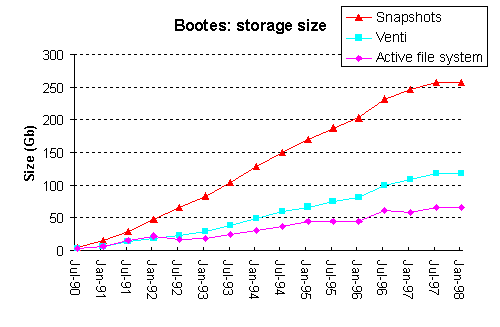
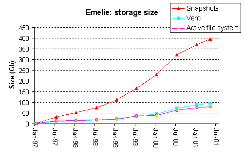

[This page was originally http://cm.bell-labs.com/who/seanq/p9trace.html.
Another archived copy can be found at <https://9p.io/who/seanq/p9trace.html>.]

# Plan 9 File System Traces

## Overview

The [Plan 9 file system](p9fs.md)
has the unusual property of permanently
retaining daily snapshots of its contents. During 2001, the snapshots
for several Plan 9 file servers were moved from write-once optical storage to a new archival storage server.
As part of this process, we have created a set of block level trace files
that track the daily state of these file systems, spanning a period of more than a decade.
These trace files may be interesting to other researchers.

The traces consist of a condensed version of each file system's data blocks, including
a hash of each block's contents, all the block pointers and most of the directory information.
The traces do not include the actual contents of files nor the file names.
There is sufficient information to reconstruct the structure of the file system
and to track the daily changes to this structure over time.

## The File Servers

Within the
Computing Sciences Research
center of Bell Labs, there have been two major Plan 9 file servers:
bootes and emelie.  Bootes was our primary file repository from 1990
until 1997 at which point it was superseded by emelie.  Over the life
of these two file servers there have been 522 user accounts of which
between 50 and 100 were active at any given time.  The file servers
have hosted numerous development projects and also contain several
large data-sets including chess end games, astronomical data,
satellite imagery, and multimedia files.

The daily snapshots of a Plan 9 file server are constructed using a copy-on-write scheme, enabling
unchanged blocks to be shared between multiple snapshots.
The size of the storage containing the snapshots is as follows:

<table align="center">
<tr>
<th></th>
<th width="200">bootes</th>
<th width="200">emelie</th>
</tr>
<tr>
<td>Number of blocks</td>
<td align="center">45 million</td>
<td align="center">26 million</td>
</tr>
<tr>
<td>Block size</td>
<td align="center">6Kb</td>
<td align="center">16Kb</td>
</tr>
</table>

The following two graphs depict the size of the active file system and
the accumulative size of the snapshots.  In addition, we have
copied the snapshot data onto a new archival storage system, called
Venti, that removes duplicate blocks and compresses the block's
contents.  When stored on Venti, the snapshot data is only a small
multiple of the active file system
 size.

Using Venti, the size of the snapshot data is reduced by three
factors: elimination of duplicate blocks, elimination of block
fragmentation, and compression of the block contents.  The following
table presents the percent reduction for each of these factors.

<table align="center">
<tr>
<th></th>
<th width="150">bootes</th>
<th width="150">emelie</th>
</tr>
<tr>
<td>Elimination of duplicates</td>
<td align="center">27.8%</td>
<td align="center">31.3%</td>
</tr>
<tr>
<td>Elimination of fragments</td>
<td align="center">10.2%</td>
<td align="center">25.4%</td>
</tr>
<tr>
<td>Data Compression</td>
<td align="center">33.8%</td>
<td align="center">54.1%</td>
</tr>
<tr>
<td>Total Reduction</td>
<td align="center">59.7%</td>
<td align="center">76.5%</td>
</tr>
</table>

## The Trace Data

The trace data is available in this repository.
It was originally at ftp://www.cs.bell-labs.com/p9trace (but no longer)
and is still mirrored at <http://pdos.csail.mit.edu/p9trace/>.

We currently provide trace data for the bootes file server covering
the period Feb 27th 1990 though Feb 24th 2001 and the emelie file
server for the period Nov 7th 1996 through May 1st 2001.  The total
size of the trace data is approximately 3GB per file server.  To make
the data more manageable it has been broken up into multiple files,
each containing information on 1 million blocks.

To keep individual files smaller than GitHub's 50MB limit,
each of the files containing up to 1 million blocks
has been broken into files containing approximately at most 40 MB of records each,
using [split.go](split.go).
For example, the original bootes/bootes44 was split into bootes44a and bootes44b:

	$ cat bootes44[ab] | md5sum
	8bdabc0bc477ff46b5dcf60fbbda82ec  -
	$ cat bootes44.md5
	8bdabc0bc477ff46b5dcf60fbbda82ec	bootes44
	$

The directory also contains a [description of the format of the trace](format.txt)
data and [source code for a trace file parser](src/).

Original last modified: 11/16/2001 \
Updated for GitHub repository by rsc@swtch.com: 9/12/2024

<td valign="middle" align="right">

</td>
</tr></table>
